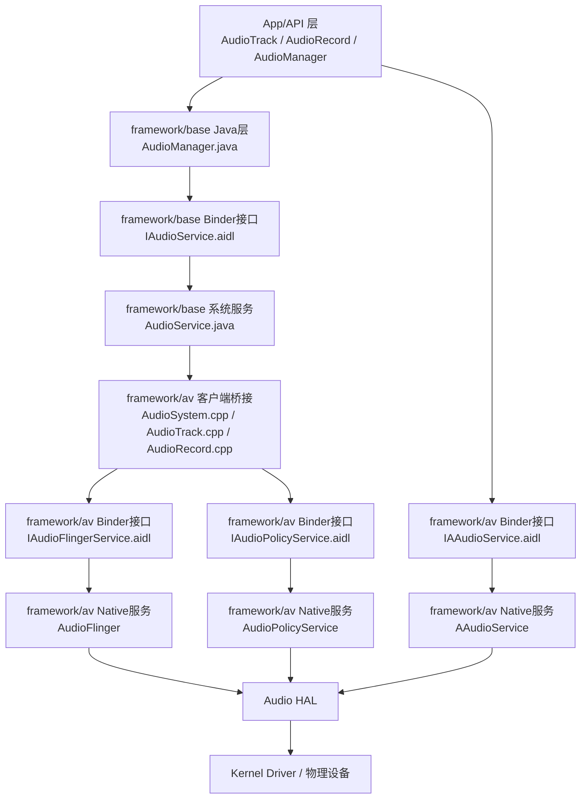

# framework/base 与 framework/av 音频调用链路流程图

本文基于仓内 `base/` 与 `av/` 代码，对 Android 音频主链路进行梳理，覆盖：
- 播放（AudioTrack）
- 录音（AudioRecord）
- 音量控制（AudioManager/AudioService/AudioPolicyService）
- 低时延路径（AAudio）

## 1. 总体分层流程图

## 2. 关键调用链（含代码锚点）

### 2.1 播放链路（AudioTrack）
1. Java API 发起播放
   - `base/media/java/android/media/AudioTrack.java`
2. Native 客户端创建 Track
   - `av/media/libaudioclient/AudioTrack.cpp` `createTrack_l()` 内调用 `audioFlinger->createTrack(...)`
3. Binder 到 AudioFlinger
   - `av/media/libaudioclient/aidl/android/media/IAudioFlingerService.aidl` `createTrack(...)`
4. 服务端创建轨道并进入混音线程
   - `av/services/audioflinger/AudioFlinger.cpp` `AudioFlinger::createTrack(...)`

### 2.2 录音链路（AudioRecord）
1. Java API 发起录音
   - `base/media/java/android/media/AudioRecord.java`
2. Native 客户端创建 Record
   - `av/media/libaudioclient/AudioRecord.cpp` `openRecord_l()` 内调用 `audioFlinger->createRecord(...)`
3. Binder 到 AudioFlinger
   - `av/media/libaudioclient/aidl/android/media/IAudioFlingerService.aidl` `createRecord(...)`
4. 服务端创建录音轨
   - `av/services/audioflinger/AudioFlinger.cpp` `AudioFlinger::createRecord(...)`

### 2.3 音量控制链路（AudioManager -> AudioService -> AudioPolicy/AudioFlinger）
1. App 调整音量
   - `base/media/java/android/media/AudioManager.java` `adjustStreamVolume(...)`
2. Binder 接口进入系统服务
   - `base/media/java/android/media/IAudioService.aidl` `adjustStreamVolumeWithAttribution(...)`
   - `base/services/core/java/com/android/server/audio/AudioService.java` `adjustStreamVolume(...)`
3. Native 桥接与策略/执行
   - `av/media/libaudioclient/AudioSystem.cpp` `AudioSystem::setStreamVolume(...)`
   - `av/services/audiopolicy/service/AudioPolicyService.cpp` `setStreamVolume(...)`
   - `av/services/audioflinger/AudioFlinger.cpp` `setStreamVolume(...)`

### 2.4 低时延链路（AAudio）
1. AAudio 客户端发起
   - `av/media/libaaudio/src/client/AudioStreamInternal.cpp`
2. Binder 到 AAudio 服务
   - `av/media/libaaudio/src/binding/aidl/aaudio/IAAudioService.aidl` `openStream(...)`
3. 服务端处理
   - `av/services/oboeservice/AAudioService.h/.cpp` `openStream(...)`

## 3. 备注
- 当前仓内未检索到 `MANAGE_APP_AUDIO_MUTE` / `setAppMute` / `isAppMuted` 相关 API；本流程图以现有主线接口为准。
- 本文仅描述主链路，细节如音频焦点、effect 链、设备路由策略分支在对应 service 内另有展开。
